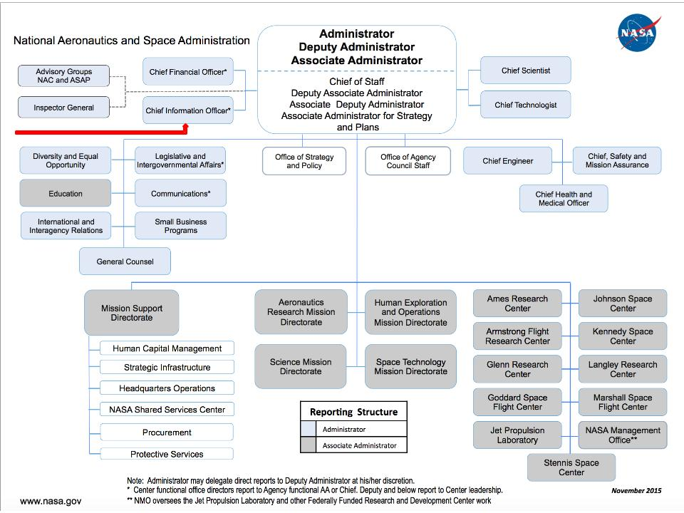

#Open Government Plan 2016
##September 2016

###TABLE of CONTENTS
- Letter from Chief Information Officer
- NASA and Open Government

NASA is an open government agency based on the founding legislation in the National Aeronautics and Space Act of 1958, which calls for participation and sharing in the conduct of how we go about the business of expanding the frontiers of knowledge, advancing understanding of the universe, and serving the American public.

From 2010 to date, NASA’s Open Government Initiative has matured, evolved, and adapted to shifting priorities in leadership from the White House, Office of Management and Budget, and NASA executives. The original tenets have not changed; however, the application of open government principles -- participation, transparency, and openness -- are applied according to priorities of agency leadership.

- NASA Organizational Structure

- Cross-cutting Objectives
The first two Open Gov Plans cite the following five cross-cutting objectives, which still apply:
  1. Increase Agency transparency and accountability to external stakeholders,
  2. Enable citizen participation in NASA missions (prizes and challenges, citizen science),                
  3. Improve internal NASA collaboration and innovation,
  4. Encourage partnerships that can create economic opportunity, and
  5. Institutionalize Open Gov philosophies and practices at NASA.

- What’s New
  - Open Innovation Platforms
    - Citizen Science
    - NASA Solve
    - Center of Excellence for Collaborative Excellence
    - Open Data platforms
  - Women in Data Initiatives
  - Federally Funded Scientific Research Data Initiative
  - Code Sharing
  - Small Business Innovation Research/Small Business Technology Transfer
- Keeping Track: From Then to Now
  - OMB Memo M-16-16
  - Historical and Ongoing Activities included in previous Open Gov Plans
    - Freedom of Information Act: 2010, 2012, 2014, 2016
    - Congressional requests: 2010, 2012, 2016
    - Declassification: 2010, 2014, 2016
    - Records Management: 2010, 2014, 2016
    - Procurement: 2010
    - Web Initiatives: 2010, 2012, 2014, 2016 (Flagship in 2012)
    - NASA TV: 2010
    - Education Activities: 2010
    - Space Communication and Navigation: 2010
    - Centennial Challenges: 2010
    - Space Act agreements: 2010
    - Tech Transfer: 2010
    - Engineering Network and NASA Technical Report Server: 2010
    - NASA and Data.gov: 2010, 2016
    - Financial Transparency: 2010, 2016
    - Access and Utilization of NASA Science Data: 2010, 2016
    - Office of the Chief Information Officer: 2010
    - Open Innovation Projects: 2010, 2016
    - Open Data: 2012, 2014, 2016
    - Open Source Software: 2012, 2014, 2016
    - Technology Accelerators: 2012
    - Prizes and Challenges: 2012
    - Citizen Science: 2012, 2016
    - Educational Infrastructure: 2010
    - Zero Robotics: 2010
    - IT Labs: 2012
    - PhoneSat: 2012
    - Center of Excellence for Collaborative Innovation: 2012, 2016
    - Scientific and Technical Information: 2012
    - Collaborative Spaces: 2012
    - Open Government Directory: 2012
    - Collaborative Code Repository: 2014, 2016
    - Digital Strategy: 2014
    - Proactive Disclosures: 2014, 2016
    - Public Notice: 2014, 2016
    - Privacy: 2014, 2016
    - Whistleblower Protection: 2014, 2016
- Flagship Initiatives: Historical Plan Matrix
  - Open Source Software Development: 2010, 2016
  - NO LONGER ACTIVE - Nebula: 2010
  - Participatory Exploration Office: 2010
  - NASA Web Environment: 2012, 2014, 2016
  - Climate Data Initiative: 2012
  - NASA Information Architecture and Management: 2014
  - Asteroid Grand Challenge: 2014
- Conclusion
